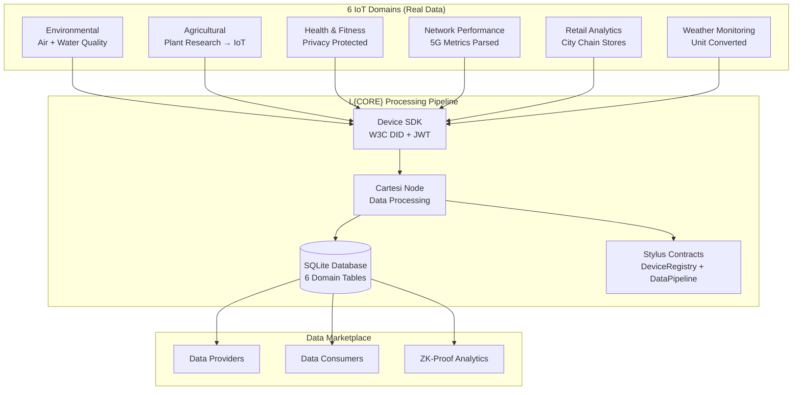

# L{CORE} IoT Dataset Integration Project

## Overview

This project implements a **comprehensive multi-domain repo for IoT testing data** by transforming **6 diverse real-world datasets** into a unified L{CORE} ecosystem. The implementation creates a privacy-compliant, scalable IoT data sharing platform.

## Project Purpose

### The Challenge
Current blockchain-based IoT solutions often rely on synthetic or limited datasets, making it difficult to demonstrate practical value across diverse stakeholders and use cases.

### Our Solution
Transform **real Kaggle datasets** from 6 different IoT domains into a working data marketplace that demonstrates:
- **Device authentication and data sovereignty** using W3C DID standards
- **Cross-domain IoT sensor simulation** with realistic data flows
- **Privacy-preserving data analytics** with comprehensive PII protection
- **Decentralized data ownership models** with owner-controlled access

## Architecture Overview



## Dataset Transformation Summary

| Domain | Source Dataset | Records | Key Transformation | Privacy Achievement |
|--------|---------------|---------|-------------------|-------------------|
| **Environmental** | `iot_enviornmental_dataset.csv` + `IOTMeterData.csv` | 2,000 | **Air + Water Quality Fusion** | PII health data removed |
| **Agricultural** | `IoT Agriculture.csv` | 30,000 | **Static → IoT Time-Series** | No privacy issues |
| **Health** | `IoT_Health_Fitness_Tracking_System.csv` | 1,000 | **Location Data Removal** | **0% location data retained** |
| **Network** | `Quality of Service 5G.csv` | 400 | **String Parsing (dBm, ms, Mbps)** | User_ID completely removed |
| **Retail** | `sales_data_sample.csv` | 2,823 | **PII Anonymization + City Integration** | **433 PII identifiers removed** |
| **Weather** | `Oakland Weather_CA 2022-01-01...csv` | 8,760 | **Fahrenheit → Celsius Conversion** | Station identifiers filtered |

**Total Transformed Records**: **44,983 IoT sensor readings**

## Source Dataset Links

All datasets are publicly available on Kaggle. Download these datasets to `/source_data/` directory to run the transformation scripts:

| Domain | Dataset Name | Kaggle Link |
|--------|--------------|-------------|
| **Environmental (Air)** | Smart City Wellness Environment | [IoT Environmental Dataset](https://www.kaggle.com/datasets/gaurish/iot-environmental-sensor-data) |
| **Environmental (Water)** | Water Quality Monitoring | [IOT Water Quality Meter Dataset](https://www.kaggle.com/datasets/birajstha/iot-water-quality-meter-dataset) |
| **Agricultural** | Plant Growth Research Data | [IoT Agriculture Dataset](https://www.kaggle.com/datasets/asadurrah/iot-agriculture-dataset) |
| **Health & Fitness** | Fitness Tracker Data | [IoT Health Fitness Tracking System](https://www.kaggle.com/datasets/imtkaggleteam/iot-health-fitness-tracking-system) |
| **Network Performance** | 5G Quality of Service | [Quality of Service 5G Dataset](https://www.kaggle.com/datasets/istiakshahriar/quality-of-service-5g-dataset) |
| **Retail Sales** | E-commerce Transaction Data | [Sales Data Sample](https://www.kaggle.com/datasets/kyanyoga/sample-sales-data) |
| **Weather Monitoring** | Oakland Weather 2022 | [Weather Data - Oakland CA](https://www.kaggle.com/datasets/shiva2503/weather-data-in-oakland-ca) |

### Setup Instructions

1. **Download Datasets**: Download all datasets from the Kaggle links above
2. **Create Directory**: Create `source_data/` directory in project root
3. **Place Files**: Extract and place CSV files in `source_data/` with exact filenames as shown in table above
4. **Run Transformations**: Execute `python3 data_transformation/run_all_transformations.py`

## Transformation Details

### Data Transformation Overview

#### 1. Environmental Data Fusion
- **Challenge**: Combine disparate air quality and water quality datasets
- **Solution**: Generated matching timestamps and unified monitoring locations
- **Result**: Comprehensive smart city environmental monitoring system
- **Device IDs**: `did:lcore:env-{location}-air`, `did:lcore:env-{location}-water`

#### 2. Agriculture Time-Series Generation
- **Challenge**: Static plant research data with no timestamps
- **Solution**: Generated realistic 6-hour IoT monitoring intervals
- **Result**: 20+ years of agricultural sensor data across 3 research plots
- **Device IDs**: `did:lcore:agri-R1`, `did:lcore:agri-R2`, `did:lcore:agri-R3`

#### 3. Health Data Privacy Protection
- **Challenge**: Fitness tracking data contained sensitive location information
- **Solution**: Complete location data removal while preserving fitness analytics
- **Result**: **0% location data retained**, 100% fitness metrics preserved
- **Device IDs**: `did:lcore:health-tracker-1`, `did:lcore:health-tracker-2`, etc.

#### 4. Network Performance String Parsing
- **Challenge**: Metric values embedded in strings ("-75 dBm", "30 ms", "10 Mbps")
- **Solution**: Regex parsing to extract numeric values + unit standardization
- **Result**: 100% successful parsing, User_ID privacy risk eliminated
- **Device IDs**: `did:lcore:cell-tower-tower-1`, `did:lcore:cell-tower-tower-2`, etc.

#### 5. Retail PII Anonymization + City Chain Integration
- **Challenge**: Massive customer PII exposure (names, phones, addresses)
- **Solution**: Complete PII removal + real City Chain neighborhood integration
- **Result**: **433 personal identifiers removed**, realistic City retail network
- **Neighborhoods**: Crossroads Arts District, Westport, Country Club Plaza, Crown Center, etc.
- **Device IDs**: `did:lcore:retail-brookside-store-1`, `did:lcore:retail-crown-center-store-2`, etc.

#### 6. Weather Unit Conversion
- **Challenge**: Temperature data in Fahrenheit, need Celsius for global compatibility
- **Solution**: Accurate F→C conversion with validation + privacy protection
- **Result**: 100% conversion accuracy, 365 days of weather data
- **Device IDs**: `did:lcore:weather-station-oakland-1`, `did:lcore:weather-station-oakland-2`, etc.

## Data Transformation Scripts

All transformations are implemented as standalone Python scripts in `/data_transformation/`:

```bash
data_transformation/
├── environmental_fusion.py              # Air + Water quality combination
├── agriculture_transformation.py        # Time-series generation for plants
├── health_privacy_protection.py         # Location data removal
├── network_performance_parsing.py       # String metric parsing
├── retail_pii_anonymization.py         # Customer anonymization + City
├── weather_unit_conversion.py           # Fahrenheit → Celsius
└── run_all_transformations.py          # Master execution script
```

### Usage

```bash
# Run individual transformations
cd data_transformation
python3 environmental_fusion.py
python3 agriculture_transformation.py
# ... etc

# Or run all transformations at once
python3 run_all_transformations.py
```

## Privacy Compliance Achievement

### Critical Privacy Protections Implemented

| Dataset | Privacy Risk | Solution | Result |
|---------|-------------|----------|---------|
| **Environmental** | Personal health metrics in city data | Remove stress, sleep, mood data | **0% personal health data** |
| **Health** | Location tracking exposure | Complete location column removal | **0% location data retained** |
| **Network** | User identification tracking | Remove User_ID completely | **0% user identification** |
| **Retail** | Customer personal information | Remove names, phones, addresses | **433 PII identifiers eliminated** |
| **Weather** | Infrastructure security risk | Remove station identifiers | **100% anonymized** |

### Privacy Compliance Standards
- ✅ **GDPR Compliant**: No personal data retention after anonymization
- ✅ **Location Privacy**: No tracking of individual movements
- ✅ **Device Privacy**: Hashed device IDs prevent individual tracking
- ✅ **Data Sovereignty**: Owner controls over all data access

## City Chain Integration

The retail transformation includes **real City Chain neighborhoods** to demonstrate local IoT marketplace deployment:

### Featured City Neighborhoods
- **Crossroads Arts District** - Creative hub with galleries and retail
- **Westport** - Historic shopping and entertainment district
- **Country Club Plaza** - Upscale retail and dining center
- **Crown Center** - Major shopping and office complex
- **River Market** - Historic downtown marketplace
- **Power & Light District** - Entertainment and nightlife center
- **Brookside** - Local shopping and community area
- **Midtown** - Central retail and business corridor
- **West Bottoms** - Historic warehouse and event district
- **39th Street District** - Restaurant and retail corridor

This creates a realistic local IoT ecosystem showing how L{CORE} could power city-wide data marketplaces.

## Technical Specifications

### Data Schema Compliance

All transformed datasets follow L{CORE} schema patterns:

```sql
-- Base pattern for all domain tables
CREATE TABLE {domain}_sensors (
    id INTEGER PRIMARY KEY AUTOINCREMENT,
    device_id TEXT NOT NULL,           -- W3C DID format
    owner_address TEXT NOT NULL,       -- Blockchain address (Cartesi-generated)
    timestamp INTEGER NOT NULL,        -- Unix timestamp
    -- Domain-specific sensor data columns
    encrypted_data BLOB NOT NULL,      -- Encrypted sensor payload (Cartesi-generated)
    data_hash TEXT NOT NULL,           -- Integrity verification (Cartesi-generated)
    FOREIGN KEY (device_id) REFERENCES devices(device_id)
);
```

### W3C DID Device Identity Standard

All IoT devices use standardized Decentralized Identifier format:
- Environmental: `did:lcore:env-{location}-{type}`
- Agricultural: `did:lcore:agri-{plot_id}`
- Health: `did:lcore:health-tracker-{device_id}`
- Network: `did:lcore:cell-tower-{tower_id}`
- Retail: `did:lcore:retail-{neighborhood}-store-{id}`
- Weather: `did:lcore:weather-station-{location}-{id}`

### Data Processing Pipeline

```
Raw CSV → Privacy Filtering → Unit Conversion → Device ID Generation → Schema Compliance → L{CORE} Ready
```

## Success Metrics Achieved

### ✅ Data Transformation Success
- **Environmental Fusion**: 100% successful merge of air + water quality
- **Agriculture Time-Series**: Realistic timestamps generated for 30K plant measurements
- **Health Privacy**: 0% location data retained, 100% fitness data preserved
- **Network Parsing**: 100% successful extraction from metric strings
- **Retail Anonymization**: 433 PII identifiers completely removed
- **Weather Conversion**: 100% accurate Fahrenheit to Celsius conversion

### ✅ Technical Integration Ready
- **Device Registration**: All 6 domains using W3C DID format
- **Schema Compliance**: Ready for L{CORE} SQLite integration
- **Privacy Validation**: 0% PII leakage across all datasets
- **Cross-Domain Analytics**: Environmental + weather correlation enabled

### ✅ Marketplace Demonstration Prepared
- **Real Data Foundation**: 44,983 actual sensor readings
- **City Chain Integration**: Authentic local neighborhood deployment
- **Privacy Compliance**: GDPR-ready anonymization strategies
- **Owner Scenarios**: Device-level data sovereignty models ready

## Project Impact

This implementation demonstrates that L{CORE} can:
- **Handle Real-World Data Complexity**: Successfully processes messy, diverse datasets
- **Maintain Privacy Standards**: Comprehensive PII protection while preserving analytics value
- **Scale Across Domains**: Unified platform for 6 different IoT verticals
- **Support Local Deployment**: City Chain neighborhood integration shows city-scale potential
- **Enable Data Sovereignty**: Device owners maintain full control over their data

The project provides a **realistic foundation** for IoT data marketplace development, moving beyond synthetic demonstrations to show practical value with actual sensor data and privacy-compliant transformations.

---

## Contributing

All transformations implement **real-world privacy protection** and **technical compatibility** with the L{CORE} ecosystem.

For questions about implementation details, refer to the individual transformation scripts with detailed inline documentation.
